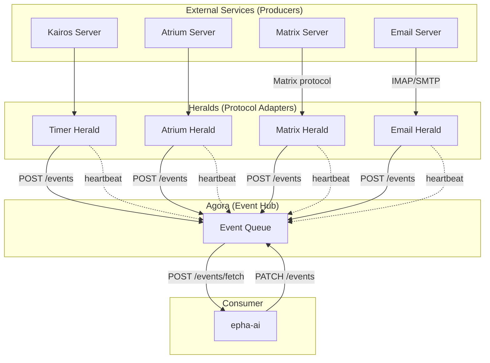
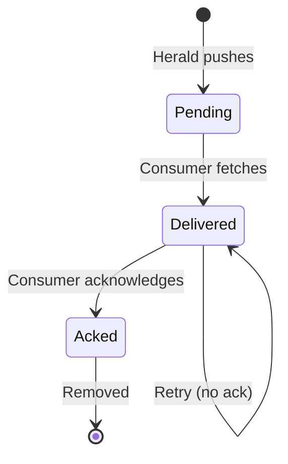
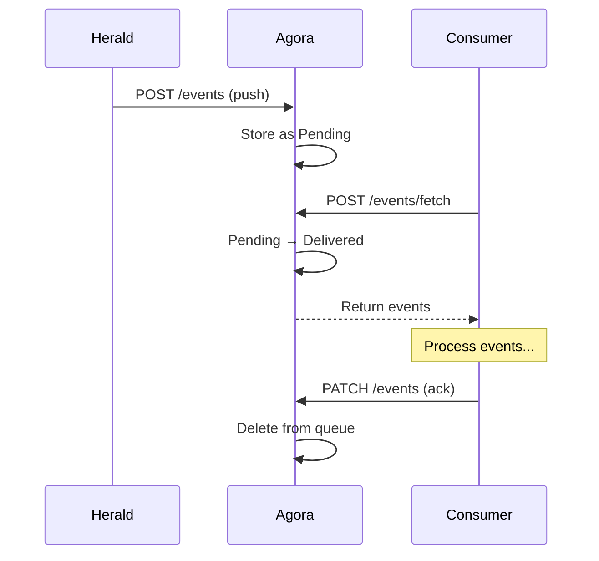

# Event System Architecture

Agora is the central event hub for Ephemera AI, receiving events pushed by Heralds and providing them for consumers to pull.

## Naming Convention

| Role      | Name              | Origin                           |
| --------- | ----------------- | -------------------------------- |
| Producer  | External services | kairos, atrium, matrix, email... |
| Adapter   | **Herald**        | Ancient Greek messenger          |
| Event Hub | **Agora**         | Ancient Greek gathering place    |
| Consumer  | epha-ai           | -                                |

## Examples Used in This Document

| Service | Type        | Description              |
| ------- | ----------- | ------------------------ |
| Kairos  | Internal    | Timer/scheduling service |
| Atrium  | Internal    | Basic chat system        |
| Matrix  | Third-party | Decentralized messaging  |
| Email   | Third-party | Email communication      |

These are examples to illustrate the architecture — the design applies to any external service.

## Why Herald?

Third-party services (Matrix, Email) are general-purpose and cannot adapt to Ephemera AI's specific interfaces. They may also run on remote servers while Ephemera AI runs locally.

Herald serves as a **protocol adapter**:

**Herald responsibilities:**
- Act as client to external services
- Convert protocols (Matrix/Email → Ephemera AI event format)
- Register with Agora and maintain heartbeat
- Usually stateless (or temporary in-memory state only)

**Herald does NOT handle**: How epha-ai interacts with external systems. That is done through dedicated CLIs (e.g., `kairos-cli`, `atrium-cli`) designed for AI agent use.

**Consumer uses POST to fetch**: `POST /events/fetch` (not `GET`) because it changes event state (Pending → Delivered). Per HTTP semantics, GET should be safe and idempotent.

## Event Lifecycle

**States:**
- **Pending**: Never fetched
- **Delivered**: Fetched, waiting for ack
- **Acked**: Confirmed, removed from queue

## Reliability

### At-Least-Once Delivery

Events may be redelivered after server restart. Consumer handles idempotency.

### Retry Mechanism

Delivered events without ack are retried with exponential backoff. All values are configurable:

| Config             | Example | Description      |
| ------------------ | ------- | ---------------- |
| `base_interval_ms` | 5000    | Initial interval |
| `multiplier`       | 2       | Growth factor    |
| `max_interval_ms`  | 300000  | Cap (5 min)      |

Formula: `base * multiplier^retry_count`, capped at max.

Events retry forever at max interval — no exhaustion.

## Herald Health

| Status       | Condition                     |
| ------------ | ----------------------------- |
| Active       | Heartbeat within `timeout_ms` |
| Disconnected | No heartbeat for `timeout_ms` |

`timeout_ms` is configurable — no hardcoded thresholds.

This is intentionally simple: only two states, no intermediate "degraded" status. If a Herald stops sending heartbeats, it's either active or disconnected.

## Storage

- **SQLite**: Pending events only (source of truth for "work to do")
- **In-Memory**: Delivery state tracking (delivered_at, retry_count)

On restart: All SQLite events loaded as Pending. Previously Delivered events become Pending again (at-least-once semantics).

## Reference

Agora API specification: `docs/api/agora.yaml`
