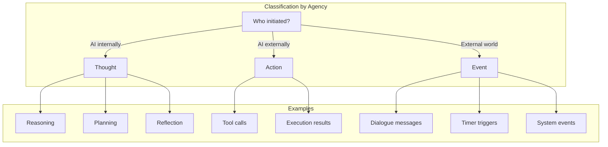

# Memory Kinds

Memory fragments are classified by **source and agency** — who initiated the activity.

## The Three Kinds

| Kind        | Source         | Agency | Examples                        |
| ----------- | -------------- | ------ | ------------------------------- |
| **Thought** | AI internal    | AI     | Reasoning, planning, reflection |
| **Action**  | AI external    | AI     | Tool calls, execution results   |
| **Event**   | External world | Not AI | Dialogue, timer, system events  |

### Thought — "I am thinking"

Internal cognitive processes generated by the AI itself.

- Reasoning about problems
- Planning future actions
- Reflecting on past experiences
- Internal monologue

**Key insight**: Thoughts have no external footprint — they exist only within the AI's cognitive space.

### Action — "I am doing"

Activities initiated by the AI that affect the external world.

- Tool calls
- Execution results

**Key insight**: Actions are the AI's way of exercising agency — translating thought into effect.

### Event — "Something happened"

External information injected into the AI's context.

- Dialogue messages from users
- Timer triggers
- System events (startup, shutdown, config changes)
- Notifications from external services

**Key insight**: Events are not initiated by the AI — they are perceived, not generated.

#### Event vs Message

We use **Event** (not Message) because:

| Aspect      | Message              | Event              |
| ----------- | -------------------- | ------------------ |
| Semantics   | Communication        | Something happened |
| Expectation | May require response | Notification only  |
| Direction   | Sender → Receiver    | Source → Observer  |

**Event** = Something happened in the external world that the AI perceives.

## Unknown Kind

`Unknown` indicates a classification error. When encountered, it should be investigated and corrected — it means the memory system failed to properly categorize a fragment.

## Design Rationale

The three-kind classification is based on a simple question: **Who initiated this?**

This classification enables:
- **Filtering**: Query memories by kind (e.g., "show me all actions")
- **Analysis**: Understand patterns in AI behavior
- **Context building**: Construct prompts with appropriate memory mix
