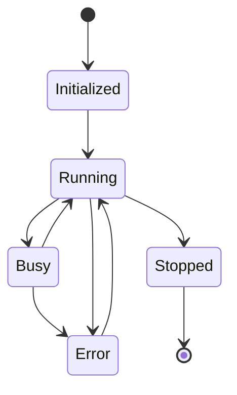

# EPHA Agent Architecture

## High-Level Architecture

```
┌─────────────────┐    Op     ┌─────────────────┐    Event    ┌─────────────────┐
│   User/UI       │ ────────► │   AgentEngine   │ ──────────► │   User/UI       │
└─────────────────┘           └─────────────────┘           └─────────────────┘
                                      │
                                      │
                                      ▼
┌─────────────────┐    manages    ┌─────────────────┐
│  AgentManager   │ ◄──────────── │  AgentSession   │
└─────────────────┘               └─────────────────┘
        │                                 │
        │ creates                         │ manages
        ▼                                 ▼
┌─────────────────┐               ┌─────────────────┐
│     Agent       │               │  TurnContext    │
└─────────────────┘               └─────────────────┘
        │
        │ uses
        ▼
┌─────────────────┐
│    ToolBox      │
└─────────────────┘
```

## Communication Flow

### Submission Queue (SQ) Flow
1. User creates `Op` (UserInput, CreateAgent, etc.)
2. `Op` wrapped in `Submission` with session_id
3. Submission sent to AgentEngine via Submission Queue
4. AgentEngine processes submission asynchronously

### Event Queue (EQ) Flow
1. Agent processes submission and generates results
2. Results wrapped in `Event` with EventMsg
3. Events sent to user via Event Queue
4. User receives real-time updates

## Core Components

### AgentEngine
- **Role**: Central coordinator and event loop
- **Responsibilities**:
  - Process submissions from SQ
  - Manage session lifecycle
  - Coordinate between subsystems
  - Emit events to EQ

### AgentSession
- **Role**: Manages conversation state
- **Responsibilities**:
  - Maintain conversation history
  - Track active turns
  - Provide session context
  - Handle turn lifecycle

### AgentManager
- **Role**: Multi-agent lifecycle management
- **Responsibilities**:
  - Agent creation and destruction
  - Agent type registration
  - Inter-agent communication
  - Resource management

### Agent
- **Role**: Individual AI agent implementation
- **Responsibilities**:
  - Process messages
  - Execute tools
  - Maintain state
  - Generate responses

### ToolBox
- **Role**: Agent tool collection
- **Responsibilities**:
  - Tool registration and discovery
  - Tool execution
  - Parameter validation
  - Result formatting

## Event Types

### User Operations (Op)
```rust
pub enum Op {
    UserInput { content: String },
    UserTurn { content: String, agent_id: Option<AgentId>, context: HashMap<String, String> },
    CreateAgent { config: AgentConfig },
    CreateSession { agent_ids: Vec<AgentId> },
    SendToAgent { agent_id: AgentId, content: String },
    Interrupt,
    // ... more operations
}
```

### Agent Events (EventMsg)
```rust
pub enum EventMsg {
    SessionConfigured { session_id: SessionId, agent_ids: Vec<AgentId> },
    UserMessage { content: String },
    AgentMessageDelta { agent_id: AgentId, content: String, is_complete: bool },
    ToolExecutionStart { agent_id: AgentId, tool_name: String, parameters: Value },
    ToolExecutionComplete { agent_id: AgentId, tool_name: String, result: Value, success: bool },
    AgentCreated { agent_id: AgentId, config: AgentConfig },
    Error { agent_id: Option<AgentId>, error: String },
    // ... more event types
}
```

## Agent States



## Multi-Agent Collaboration

### Agent Types
- **ChatAgent**: General conversation handling
- **ToolAgent**: Specialized tool execution
- **CoordinatorAgent**: Manages other agents
- **CustomAgent**: User-defined specializations

### Collaboration Patterns
1. **Sequential**: Agents work in sequence
2. **Parallel**: Agents work simultaneously
3. **Hierarchical**: Coordinator manages worker agents
4. **Peer-to-Peer**: Direct agent communication

### Inter-Agent Communication
```rust
pub struct AgentMessage {
    pub from: AgentId,
    pub to: AgentId,
    pub content: String,
    pub message_type: AgentMessageType,
    pub timestamp: DateTime<Utc>,
}
```

## Tool System

### Tool Interface
```rust
#[async_trait]
pub trait Tool: Send + Sync {
    fn name(&self) -> &str;
    fn description(&self) -> &str;
    fn parameters_schema(&self) -> Value;
    async fn execute(&self, parameters: Value) -> Result<Value>;
}
```

### Tool Categories
- **System Tools**: File operations, process management
- **Network Tools**: HTTP requests, API calls
- **Data Tools**: Database operations, data processing
- **AI Tools**: LLM interactions, embeddings
- **Custom Tools**: User-defined functionality

## Configuration

### Agent Configuration
```rust
pub struct AgentConfig {
    pub name: String,
    pub agent_type: String,
    pub model: String,
    pub preamble: Option<String>,
    pub tools: Vec<String>,
    pub parameters: HashMap<String, Value>,
}
```

### Session Configuration
```rust
pub struct SessionConfig {
    pub max_history_length: usize,
    pub timeout_seconds: Option<u64>,
    pub allow_parallel_execution: bool,
}
```

## Error Handling

### Error Propagation
- Tool errors → Agent errors → Session errors → Engine events
- Graceful degradation: Continue operation despite component failures
- Error events for user notification

### Recovery Strategies
- Automatic retry for transient failures
- Fallback agents for critical operations
- Session rollback on unrecoverable errors

## Performance Considerations

### Concurrency
- Async/await throughout for non-blocking operations
- Tokio channels for efficient message passing
- Configurable resource limits

### Memory Management
- Bounded queues to prevent memory leaks
- Efficient serialization for messages
- Periodic cleanup of inactive sessions

### Scalability
- Horizontal scaling via multiple engine instances
- Load balancing across agent pools
- Persistent storage for session state

## Security

### Sandboxing
- Configurable sandbox policies for agent execution
- Tool permission system
- Resource usage limits

### Access Control
- Agent-level permissions
- Session-based access control
- Audit logging for all operations